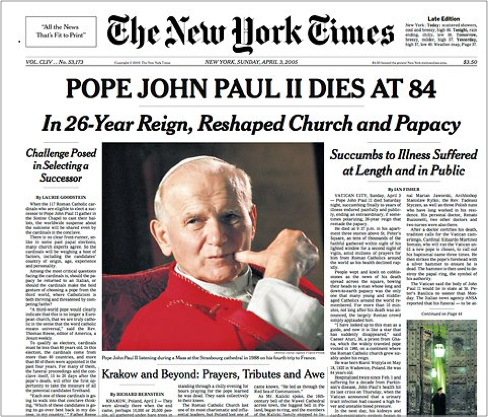
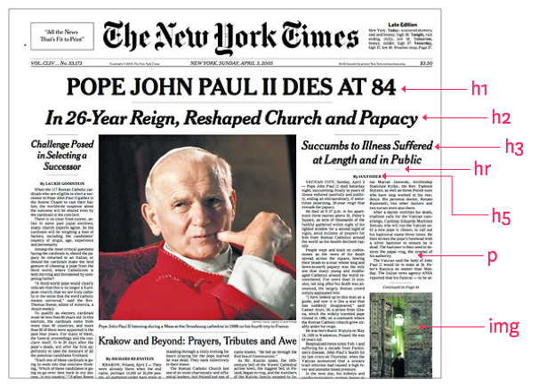

# Coding basics

## HTML + CSS

*Instructor: Paul Ballas*

#### Please head to:

[https://ga-denver-paulballas.herokuapp.com](https://ga-denver-paulballas.herokuapp.com)

<small>Slides also available on [GitHub](https://github.com/paulballas/html_css_bootcamp).</small>
---

## Hi, I'm Paul.
## Nice to meet you.

---
### Schedule
- **6:30 - 6:40** Welcome! + Introduction
- **6:40 - 6:55** What we'll be learning + The Web)
- **6:55- 8:00** HTML
- **8:00 8:15** HTML Code together
- **8:15 - 9:15** CSS
- **9:15 - 9:30** CSS Code together
- **8:15 - 9:15** CSS
- **9:30** Questions + See ya later!


---
## Introduction

(who is this dude at the front?)

--

## 1992
Convinces parents to sign up for AOL

--

## 1993
Discovers AngelFire and Geocities.
<br />
Builds first website. Fan site for **SouthPark**.

--

## Aug 1, 2003

Starts as a freshmen at Quinnipiac University in Connecicut. Hopes of playing Division 1 ice hockey.

--

## Sep 1, 2003

Realizes not good enough to play D1 hockey. Transfers to Radford University in Virgina.

--
## Fast forward.

- Graduates from Radford.
- Delays real world and stays for grad school in finance.
- Moves to Charlotte, NC and works for Bank of America as a trader
- Market crashes 6 months after starting. Gets laid off.
- Moves back home to Washington, DC

--


<br />
- Joins **HelloWallet** as 4th employee and 1st product manager.
- Combines background of coding and finance.

--


<br />
- Realize love for making wireframes and designing.
- Convinces execs to pay for classes at the D(Design) School at Stanford University.
- Becomes **Head of UX**

--


- **HelloWallet** acquired by Morningstar for $50M.
- Joins **DeloitteDigital** as a **Lead UX Designer**.

--

## June 2015
- Moves to Denver (woot!)
- Stays with DeloitteDigital (initally)
- Becomes mentor at **Galvanize**

--

## Today

- Joins **Pana** as **Head of Product** in August.
- Pana is virtual travel app, backed by:
  - **Techstars**
  - **500 Startups**
  - **Foundry Group**
  - among other angels.

--

## Also...


- Teach at **GeneralAssembly**
  - Front-end dev & UX design
- Mentors startups at **1776** (DC based incubator).
- Mentors startups at **Galvanize**.

---

#Let's get coding!

---

## The web.


<br />
<br />

We'll be learning about **web** programming today.
Code that is compiled together, placed on a server, and distributed via the internet.

--

##HTML + CSS + JS
- **HTML:** hyper text markup language
- **CSS:** Cascading style sheets
- **JS:** Javascript (*absolutley no relation to Java*)

--

##HTML + CSS + JS

 HTML (structure of house)

 CSS (colors of the walls)

 Javascript (electricity)

Let's take a close look. [**Example 1**](../code_along/ex_one.html)

---

## HTML

--

## Boring definition.

**HTML** is a markup language for describing web documents (web pages). HTML stands for Hyper Text Markup Language. A markup language is a set of markup tags. HTML documents are described by HTML tags. Each HTML tag describes different document content.

--

##Better definition.

**HTML** is a web programming language. The browser *looks* at the tags (i.e. ```<p>```) and renders the content between the tags, based on what the tag tells the computer to do.

```
<p>Hello world!</p>
```

becomes

Hello World!

--
## A tag for everything!
- Paragraph: ```<p>```
- Anchor (link): ```<a>```
- Header: ```<header>```
- Footer: ```<footer>```
- List item: ```<li>```
- Navigation: ```<nav>```

[Full list of tags (Mozilla)](https://developer.mozilla.org/en-US/docs/Web/HTML/Element)
--
## Two types of tags
### Regular and empty

- Regular: ```<div>foo bar</div>```
- Empty: ``````

Empty tags can be *optionally* be closed, but it's not required:

- `````` &nbsp; &rarr; &nbsp; ``````

--

**Semantics** is the study of the meanings of words and phrases in language. A semantic element clearly describes its meaning to both the browser and the developer.

- Non-semantic elements: ```<div>``` and ```<span>``` - Tells nothing about its content.
- Semantic elements: ```<form>```, ```<table>```, and `````` - Clearly defines its content.

**Why is it important to use a semantic tag like** ```<header>```, **opposed to just using a** ```<div>``` **tag everywhere?**
--

## If you can read a newspaper, you can learn html.

--


--


--

## Let's build the newspaper with code
[**Example 2**](../code_along/ex_two/ex_two.html)

--
## Let's take a closer look at the sections
[**Example 2**](../code_along/ex_two/ex_two5.html)

--
### Ok. I think I'm getting it.
### But what's all that extra *stuff*  at the top and bottom of the page?

--
- ```<!DOCTYPE html>``` What kind of document is this.

- ```<html>``` Just another element tag. Tells the browser html goes inside.

- ```<head>``` I'm top of the page. But not content goes inside, just info for the browser.

--

- ```<meta>``` I provide *meta* or extra info to the browser.

- ```link``` Link to another document not on this page. Typically css.

- ```<title>``` No surprise here - the title of the page.

- ```<script>``` Contains js files. Typically at the *bottom* of the page.

--

## Outline


--

# Let's write some code!

--
## What to do

- Open up *Atom* (if you don't have atom, download at [atom.io](https://atom.io/))  
- Open a new window: *Shift + Cmnd + N*.
- Save the document with the name ```index.html``` on your *Desktop*.
- Follow along in [**Example 3**](../code_along/ex_two/ex_two.html)

---
## CSS

--

## Boring definition.

**CSS** Cascading Style Sheets (CSS) is a language for specifying how documents are presented to users. These documents are written in a markup language such as HTML.

--

##Better definition.

**CSS** is a web programming language. The browser matches the **element**, **class**, or **id** to a corresponding html page.

html
```
<p>Hello world!<p>
```

css
```
p {
  color: red;
}
```
<p style="color:red;">Hello world!</p>

--


--
## A note about whitespace

Whitespace is eliminated by the browser. We use whitespace to make the code easier to read.

This is true for *all* file types - html, js, css, etc.

```
h1{color:blue;font-size:16px;}
```
vs.
```
h1 {
  color: blue;
  font-size: 16px;
}
```
<small>namespaced files are an exception... but that's for another day.</small>

--
## A property for everything!
```
h1 {
  color: #efefef; /*color of font*/
  font-size: 16px; /*size of font*/
  display: block; /*what kind of box is it?*/
  position: relative; /*how does it stack against other boxes?*/
}
```
What are those ```/*foo bar*/``` things after each line of css?

--

##Comments
Sometimes I see this:
```
<!-- Warning! Wack code below. Edit are your own risk. -->
```

But this is more helpful:
```
<!-- Hidden by default. Add class 'active' to show. -->
```
--
## Can css be interactive?

Dang straight! All you need is a ```Pseudo Class```.

When I hover over a link, change the font from red to green, and underline it.
```
a {
  color: green;
}

a:hover {
  color: purple;
  text-decoration: underline;
}
```
<a style="color: green !important;">Hover over me!</a> &nbsp; on hover &rarr; &nbsp; <a style="color: purple !important;text-decoration: underline!important;">Hover over me!</a>

[Full list of pseudo classes](http://www.w3schools.com/css/css_pseudo_classes.asp)

--
## Cascading and inheritance
<small>(This is where it get's a little tougher to understand. So don't get discouraged if you're confused.)</small>

```
a {
  color: red;
}

ul li a {
  color: blue;
}

nav ul li a {
  color: purple;
}

```
--
## Another example

```
.people {
  background-color: green;
}

.people .tom,
.people .jane {
  color: blue;
}

.people .jane .head {
  color: red;
}
```

--

## The box model

Essentially every html element is considered a **box**.

When we build a webpage, we're essentially stacking a bunch of boxes on top of each other.

--

## Box model examples

Stop thinking of a webpage like this ([**Box-lesss**](../code_along/box1.html)).

And more like this ([**Box-ified**](../code_along/box2.html)).

--
## But how do I make the boxes fit together nicely, like I'm packing a UPS truck?

--
## We'll I'm glad you asked
Let's learn about *content*, *padding*, *border*, and *margin*.

--


--
Another example

[**Box model**](../code_along/box3.html)

--

## Where does my css go?

In the ```<head>``` of my html page, with the ```<style>``` tag?

*Wrong!*

Inline on my html element, with the ```<style>``` tag?

*Wrong!*

In a separate file, placed in the ```<head>``` wit the ```link``` tag?

**Correct!!!**

--
## Why place CSS in a separate file, and link to it?
- Helps avoid duplication

- Makes maintenance easier

- Allows you to make a site-wide change in one place

--

<small>My ```index.html``` file</small>

```
<!DOCTYPE html>
<html>
  <head>
    <meta charset="utf-8">
    <link rel="stylesheet" href="/css/styles.css">
    <title></title>
  </head>
  <body>

  </body>
</html>
```
<small>My ```styles.css``` file</small>
```
p {
  color: blue;
  font-size: 16px;
}
.column {
  display: inline-block;
  width: 33%;
  float: left;
}
.column img {
  border: 1px solid #555;
}
```
--

## I've heard of class and ID, but what's are they?

## What's is the difference?

--
## Class v. ID v. element

- **Element:** Coke, Pepsi, Mountain Dew

- **Class:** Each can of Coke has bar code. It's the same barcode on every can, so any store can sell it.

- **ID:** Each *individual* can of Coke has a unique serial number (0123456).

--

## How to reference

Element
```
<p>Meow!</p>

p {color: blue;}
```

Class
```
<p class="red">Meow!</p>

.red {color: red;}
```

ID
```
<p id="push-left">Meow!</p>

#push-left {margin-left: 10px;;}
```

--
## A note about ID's

Even though you won't find a text box telling you to not use an *ID* in your css - you **should not**.

It's a long discussion why, but you should only use an *ID* with javascript.

<small>Just trust me on this :)</small>

--
# Let's write some code!

--
## What to do

- Open up *Atom*
- Create a new folder on your *Desktop*, and name it ```project```.
- *Drag* the folder to *Atom* (It'll open the folder in *Atom*)
- Create *2* different files, that'll go inside the ```project```folder:
  - One named name ```index.html```.
  - One named ```styles.css```.
- Follow along in [**Example 4**](../code_along/project/index.html)

---
## Quesitons?

... Nope! I understand everything I'm officially a code ninja.

Thought so! :)

#### Say Hello:

- Email: [paul.ballas@gmail.com](mailto:paul.ballas@gmail.com)

- Twitter: [@paulballas](https://twitter.com/paulballas)

- LinkedIn: [linkedin.com/in/paulballas](https://www.linkedin.com/in/paulballas)

- GitHub: [github.com/paulballas](https://github.com/paulballas)

--

##Resources

- [Frontend Development 1](https://gist.github.com/dypsilon/5819504)
- [Frontend Development 2](https://github.com/dypsilon/frontend-dev-bookmarks)
- [Frontend Development 2](http://enboard.co/frontend/)
