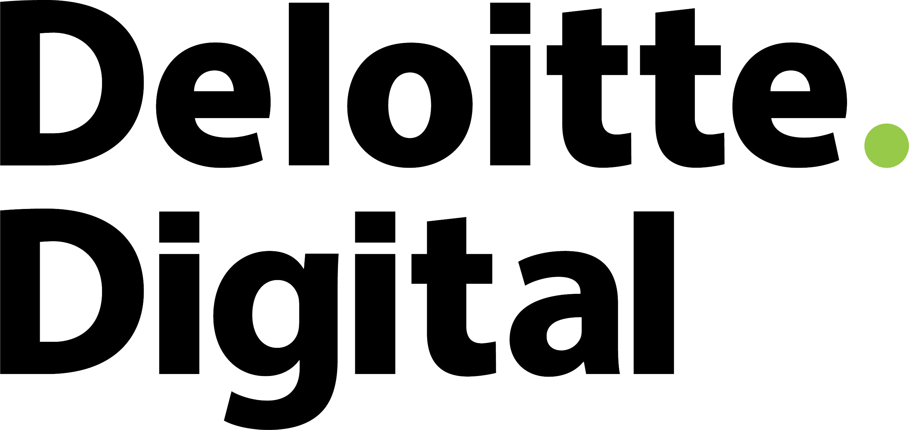

# Coding basics

## HTML + CSS

### Paul Ballas

---
## Hi, I'm Paul.
## Nice to meet you.

--

## 1992
Convinces parents to sign up for AOL

--

## 1993
Discovers AngelFire and Geocities.
 
Builds first website. Fan site for **SouthPark**.

--

## Aug 1, 2003

Starts as a freshmen at Quinnipiac University in Connecicut. Hopes of playing Division 1 ice hockey.

--

## Sep 1, 2003

Realizes not good enough to play D1 hockey. Transfers to Radford University in Virgina.

--
## Fast forward

- Graduates from Radford.
- Delays real world and stays for grad school in finance.
- Moves to Charlotte, NC and works for Bank of America as a trader
- Market crashes 6 months after starting. Gets laid off.
- Moves back home to Washington, DC

--

 
- Joins **HelloWallet** as 4th employee and 1st product manager.
- Combines background of coding and finance.

--

 
- Realize love for making wireframes and designing.
- Convinces execs to pay for classes at the D(Design) School at Stanford University.
- Becomes **Head of UX**

--

 
- **HelloWallet** acquired by Morningstar for $50M.
- Joins **DeloitteDigital** as a **Lead UX Designer**.
- Teaches **Front-End** dev 12 week course at **GA**.
- Mentors startups at **1776** (DC based incubator).

--

## June 2015
- Moves to Denver (woot!)
- Stays with DeloitteDigital (initally)
- Becomes mentor at **Galvanize**

--

- Joins **Pana** as **Head of Product** in August.
- Pana is virtual travel app, backed by:
  - **Techstars**
  - **500 Startups**
  - **Foundry Group**
  - among other angels.
